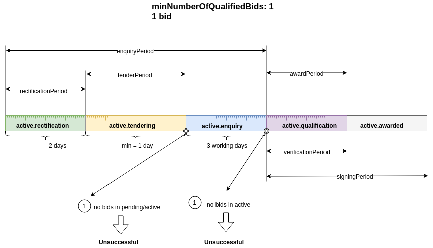
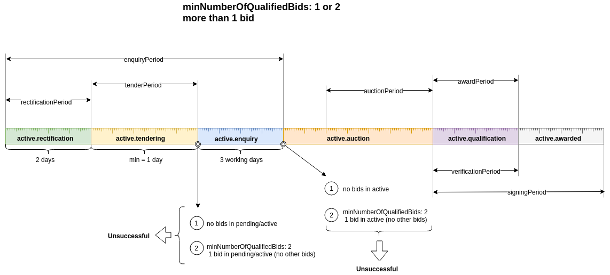

.. _procedure_workflow: 

##################
Procedure Workflow
##################

Procedure Workflow for 1 Submitted Bid
======================================

Status Workflow
---------------

.. graphviz::

    digraph G {
        subgraph cluster_1 {
            node [style=filled, fillcolor=seashell2];
            edge[style=dashed,  arrowhead="vee"];
            "draft" -> "active.rectification" [color="0.7777 1.0000 0.5020"];
            edge[style=solid,  arrowhead="vee"];
            "active.rectification" -> "active.tendering" [color="0.7777 1.0000 0.5020"];
            edge[style=solid,  arrowhead="vee"];
            "active.tendering" -> "active.enquiry" [color="0.7777 1.0000 0.5020"];
            edge[style=solid,  arrowhead="vee"];
            "active.enquiry" -> "active.qualification" [color="0.7777 1.0000 0.5020"];
            edge[dir="forward"];
            "active.qualification" -> "active.awarded" [color="0.7777 1.0000 0.5020"];
  
        color=white;
        }
            edge[style=solid]
            "active.enquiry" -> "unsuccessful" [color="0.0000 0.0000 0.3882"];
            edge[style=solid];
            "active.qualification" -> "unsuccessful" [color="0.0000 0.0000 0.3882"];
            edge[style=solid];
            "active.awarded" -> "unsuccessful" [color="0.0000 0.0000 0.3882"];

            edge[style=dashed]
            "active.enquiry" -> "cancelled" [color="0.0000 0.0000 0.3882"];
            edge[style=dashed];
            "active.qualification" -> "cancelled" [color="0.0000 0.0000 0.3882"];
            edge[style=dashed];
            "active.awarded" -> "cancelled" [color="0.0000 0.0000 0.3882"];
        
        node [style=filled, fillcolor=seashell2];
        edge[dir="forward"];
        "active.awarded" -> "complete" [color="0.7777 1.0000 0.5020"];       
    }

Roles
"""""

:Chronograph: solid

:Organizer:  dashed

Procedure Workflow for 2 Submitted Bids or More
================================================

Status Workflow
---------------

.. graphviz::

    digraph G {
        subgraph cluster_1 {
            node [style=filled, fillcolor=seashell2];
            edge[style=dashed,  arrowhead="vee"];
            "draft" -> "active.rectification" [color="0.7777 1.0000 0.5020"];
            edge[style=solid,  arrowhead="vee"];
            "active.rectification" -> "active.tendering" [color="0.7777 1.0000 0.5020"];
            edge[style=solid,  arrowhead="vee"];
            "active.tendering" -> "active.enquiry" [color="0.7777 1.0000 0.5020"];
            edge[style=solid,  arrowhead="vee"];
            "active.enquiry" -> "active.auction" [color="0.7777 1.0000 0.5020"];
            edge[style=solid,  arrowhead="vee"];
            "active.auction" -> "active.qualification" [color="0.7777 1.0000 0.5020"];
            edge[dir="forward"];
            "active.qualification" -> "active.awarded" [color="0.7777 1.0000 0.5020"];
        color=white;
        }
        edge[style=solid]
        "active.tendering" -> "unsuccessful" [color="0.0000 0.0000 0.3882"];
        edge[style=solid]
        "active.enquiry" -> "unsuccessful" [color="0.0000 0.0000 0.3882"];
        edge[style=solid]
        "active.auction" -> "unsuccessful" [color="0.0000 0.0000 0.3882"];
        edge[style=solid]
        "active.qualification" -> "unsuccessful" [color="0.0000 0.0000 0.3882"];
        edge[style=solid];
        "active.awarded" -> "unsuccessful" [color="0.0000 0.0000 0.3882"];

        edge[style=dashed]
        "active.tendering" -> "cancelled" [color="0.0000 0.0000 0.3882"];
        edge[style=dashed]
        "active.enquiry" -> "cancelled" [color="0.0000 0.0000 0.3882"];
        edge[style=dashed]
        "active.auction" -> "cancelled" [color="0.0000 0.0000 0.3882"];
        edge[style=dashed]
        "active.qualification" -> "cancelled" [color="0.0000 0.0000 0.3882"];
        edge[style=dashed];
        "active.awarded" -> "cancelled" [color="0.0000 0.0000 0.3882"];

        node [style=filled, fillcolor=seashell2];
        edge[dir="forward"];
        "active.awarded" -> "complete" [color="0.7777 1.0000 0.5020"];      
    }

Roles
"""""

:Chronograph: solid

:Organizer:  dashed
